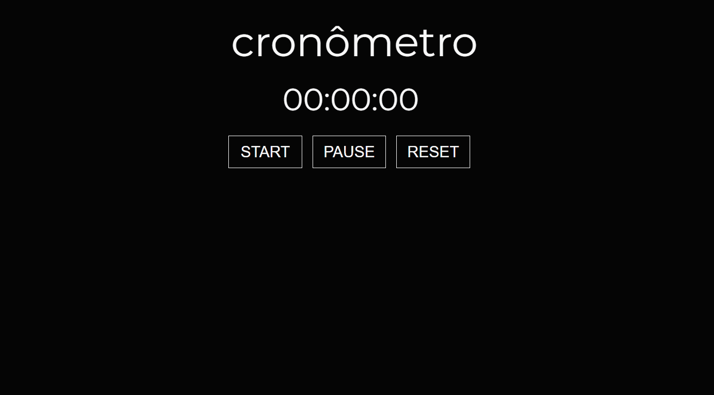

<h1 align='center'>🖥️Stopwatch</h2>

<h3 align='center'> Criation of stopwatch using html, css and pure javascript</h3>
  
### Features
-[x] Start function<br>
-[x] Pause function<br>
-[x] Reset function<br>

<h1 align="center">
  
<h1/>
  
<h2 align='center'>Prerequisites</h2>
  <p>Before starting, you will need to have the following tools installed: <a href='https://git-scm.com/downloads'>Git<a>. Also it's nice to have an editor to work with code like <a href='https://code.visualstudio.com/download'>VScode<a/></p>
    
 <h3>Instructions</h3>
    
    ```bash
    
    <p># Clone this repository<br>
    $ git clone https://github.com/alexcsales/stopwatch</p>
    <p># Run file<br>
    $ In the browser, type Ctrl + O and open the index.html</p>
    
    ```
