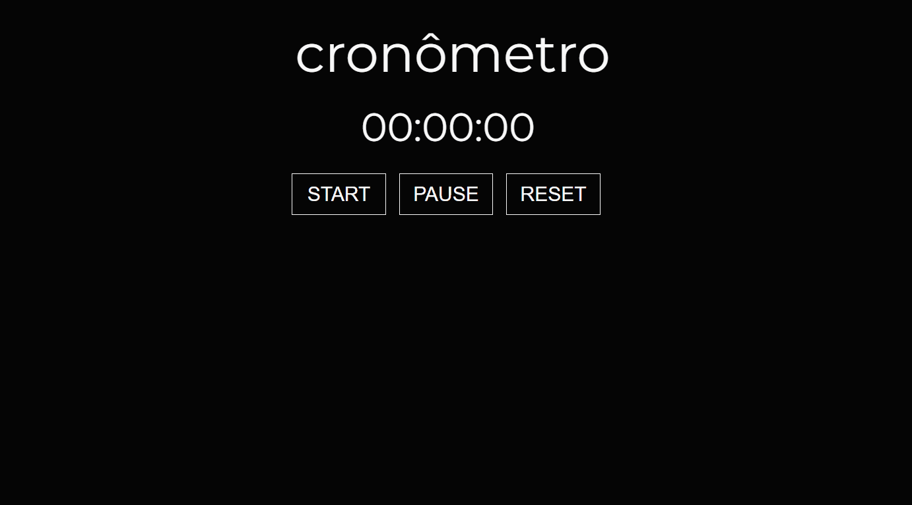

<h1 align='center'>Stopwatch</h1>

<h3 align='center'> Criation of stopwatch with start, stop and reset.</h3>
<h4 align='center'>🚀README project🚀</h4>
  
### ⚙ Features
- [x] Start function<br>
- [x] Stop function<br>
- [x] Reset function<br>

<h1 align="center">
  
<h1/>
  <hr>
  
<h2 align='center'>🖥️ Prerequisites</h2>
  <p>Before starting, you will need to have the following tools installed: <a href='https://git-scm.com/downloads'>Git<a>. Also it's nice to have an editor to work with code like <a href='https://code.visualstudio.com/download'>VScode<a/>.</p>
    
 ### 📖 Instructions:
    
 ```bash
 # Clone this repository:
 $ git clone https://github.com/alexcsales/Sundries-store
 # Run file:
 $ In the browser, type Ctrl + O and open the index.html
 ```
    
 ### 🛠 Technologies
 The following tools were used in building the project:
   - HTML<br>
   - CSS<br>
 - JavaScript
    <hr>
    
  <p>By ALEX🤘 <a href='https://www.linkedin.com/in/alexsales-dev/'>See my linkedin<a></p>
